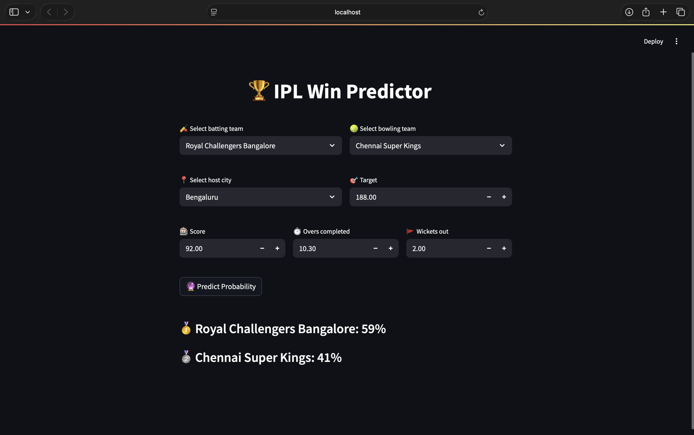

# IPL-Winning-Team-Prediction
Predicts cricket match winners using machine learning on historical match data.

[Live Demo](#) [View Predictor](#) [GitHub Repo](#) [IPL Win Predictor](#) [license](#) 


Welcome to the IPL Win Predictor — an innovative machine learning project designed to estimate a team's chances of winning an ongoing IPL match through logistic regression and real-time data!

---

## Overview

IPL Win Predictor utilizes logistic regression for insightful probability analysis, gauging a team’s likelihood of winning based on current match context, team dynamics, and individual player contributions.

---

## Demo Preview



---

## Project Highlights

[Live Demo](#) [View Predictor](#)

### Key Features

- **Live Match Analytics:** Instantly assess win probabilities as a match unfolds.
- **User-Friendly UI:** Built with Streamlit, the app offers an interactive dashboard for quick scenario simulation.
- **Flexible Match Inputs:** Tweak match details and select different teams to compare various possible outcomes.
- **Cloud Accessible:** The app is deployed on Streamlit Cloud for accessible sharing and usage.

---

## How To Use

For predictions, enter these details in the interface:

- **Batting Team:** Select the team currently playing their innings.
- **Bowling Team:** Choose the team handling the bowling.
- **City:** Pick the venue where the game is taking place.
- **Runs:** Provide the present score of the batting side.
- **Overs Completed:** Specify the number of completed overs.
- **Wickets:** List the count of wickets fallen.
- **Target Runs:** Enter the chase or total runs set by the first innings.

Based on your input, the system will output the calculated win probability for the batting side.

---

## Technologies

This solution integrates the following technologies:

- [Python](https://www.python.org/)
- [Logistic Regression](https://scikit-learn.org/stable/modules/linear_model.html#logistic-regression)
- [NumPy](https://numpy.org/)
- [pandas](https://pandas.pydata.org/)
- [Streamlit](https://streamlit.io/)

---

## Setup Instructions

To launch the app on your own device, follow the steps below:

1. Fetch a local copy of the repository:
    ```
    git clone https://github.com/rajatrawal/ipl-win-predictor.git
    ```
2. Move into the project directory:
    ```
    cd ipl-win-predictor
    ```
3. Install the Python dependencies:
    ```
    pip install -r requirements.txt
    ```
4. Start the Streamlit application:
    ```
    streamlit run app.py
    ```
5. Open the suggested local link in your browser to interact with the Win Predictor.

---

## Confidence in Predictions

Leverage this tool to enhance your IPL match insights with statistics-driven probability outputs. Visit the [Live Demo](#) to begin analyzing cricket matches in a data-centric way.

---

## Contributions

If you would like to submit changes, add features, or suggest improvements, please open a pull request or file an issue using the project's GitHub page.

Many thanks for checking out IPL Win Predictor — hope it adds an edge to your cricket predictions! 🏏✨
